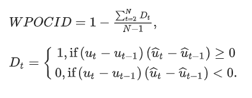

# Timeseries Metrics


This package provides several metrics used to evaluate the performance of predictive models in time series.

## Installation

You can install the package using `pip`:

```bash
pip install timeseriesmetrics
```

## Usage

The package can be used as follows:

```python
from timeseriesmetrics import *

y_true = [1, 2, 3, 4, 5]
y_pred = [3, 4, 3, 4, 5]

theil(y_true, y_pred)
```

Where `y_true` represents the real values ​​and `y_pred` the predicted values.

## Definitions

- $ N $: number of observations.
- $ u_{t} $: real values.
- $ \widehat{u}_{t} $: predicted values.
- $ \overline{u}_{t} $: mean of the real values.

## Available Metrics

### MAPE

MAPE (Mean Absolute Percentage Error) measures the accuracy of the model, presenting a relative value:


### ARV

ARV (Average Relative Variance) compares the predictor's performance with the simple average of past values ​​in the series:


### ID

ID (Index of Disagreement) disregards the unit of measurement, presenting values ​​in the interval [0, 1]:


### Theil'U 
Theil'U compares prediction performance to the Random Walk model (in which $ u_{t} $ is inferred by $ u_{t-1} $), where `Theil< 1` indicates a better prediction than the Random Walk model:


### WPOCID 
WPOCID measures how well the model predicts the trend of the target time series: 



## References

More details on the metrics discussed can be found in the article [A non-central beta model to forecast and evaluate pandemics time series](https://www.sciencedirect.com/science/article/pii/S096007792030607X).
